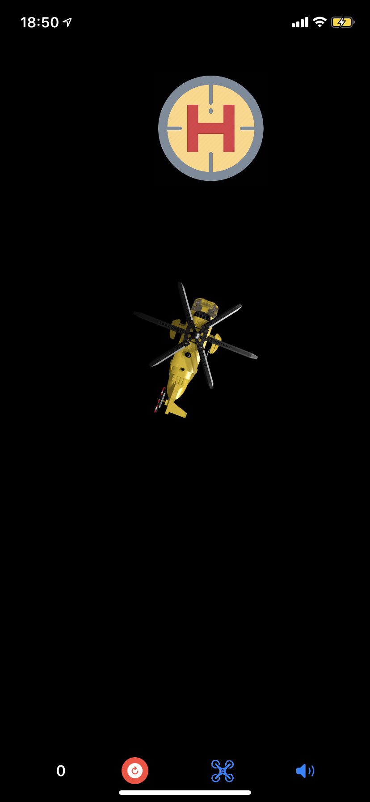
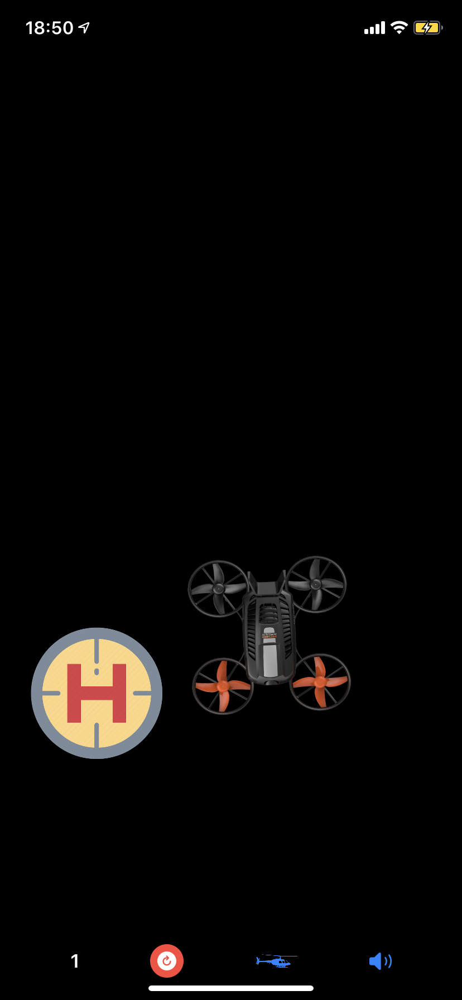
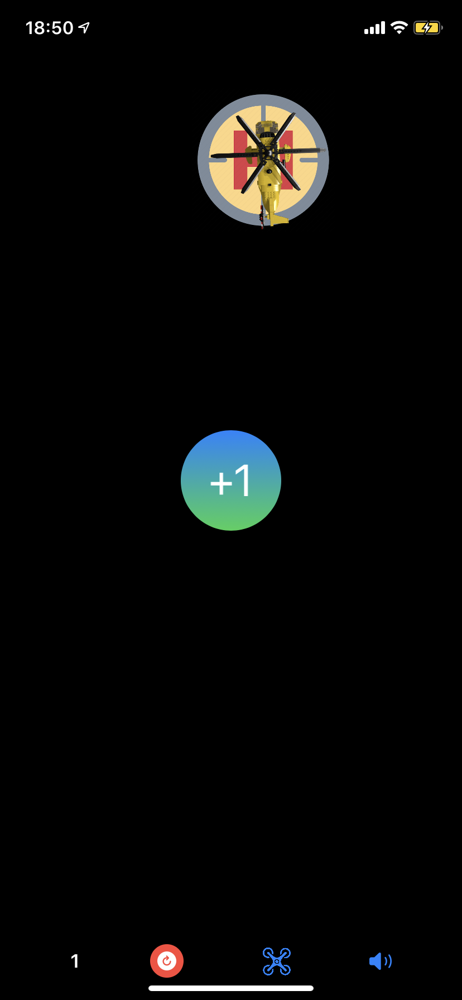
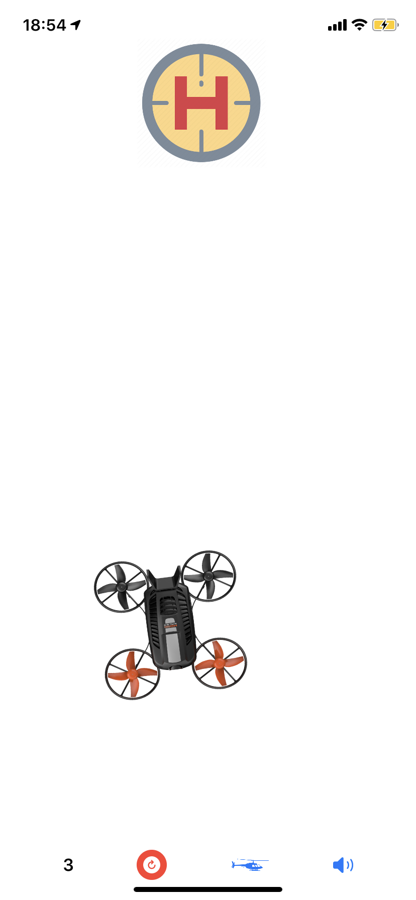
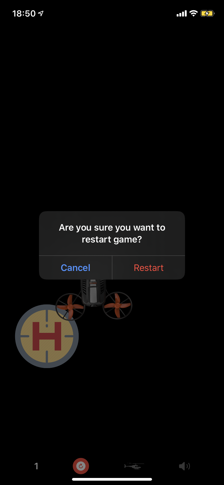

# Landing-Game

  <h3>Few words about game</h3>
 >Mini game created with basics of SwiftUI. 
  Using iPhone accelerometer user have to fly by helicopter or drone to landing pad. The initial position of aircraft is choosen randomly and it's changed after successful landing. If aircraft is close to landing pad it's slows down, getting smaller, sounds getting low. User can seamlessy change which aircraft want, turn on/off sounds and restart game. Game supports Night Mode.
  

   
  
  

 

   
  
  

## Tech
  - SwiftUI
  - Core Motion
  - AVFoundation
